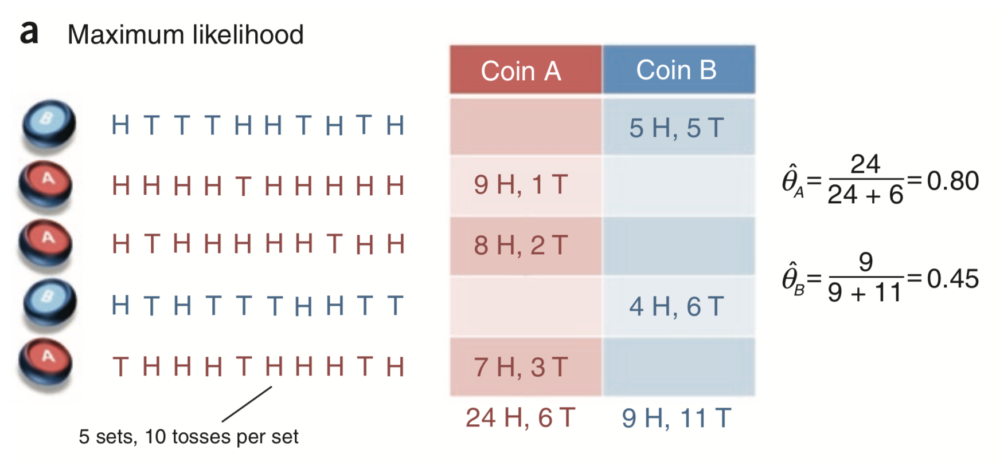
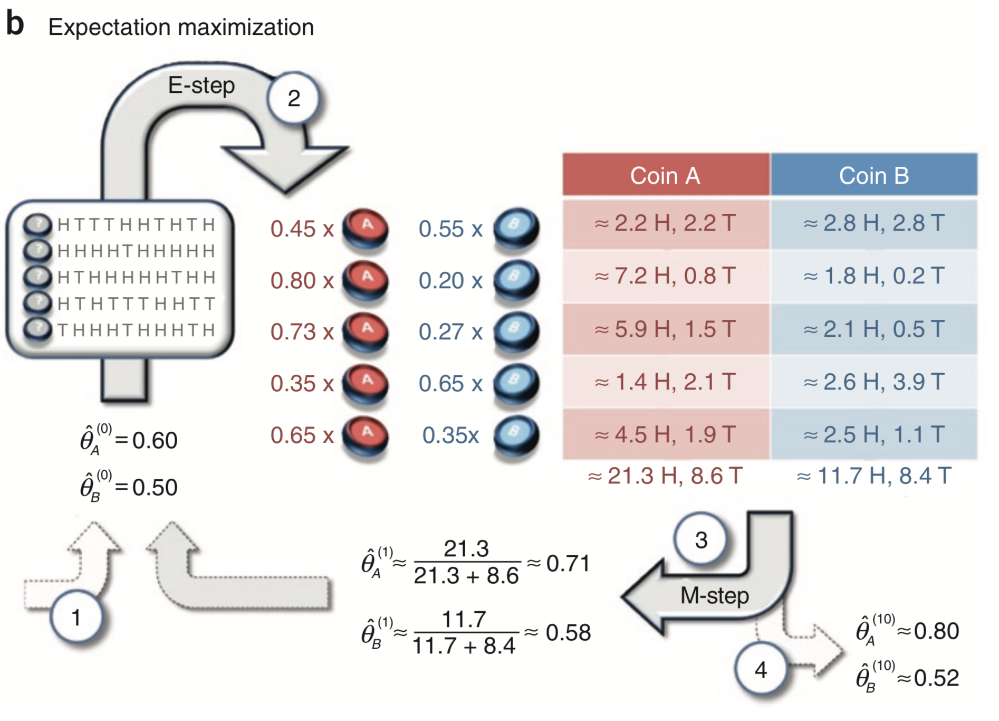

EM（expectation maximization）算法是一种用来对概率模型中不完整数据集做参数估计的方法。

假设有两种硬币 A 和 B，用 $\theta_{A}$ 来表示硬币 A 正面朝上的概率，则 $1-\theta_{A}$ 为其背面朝上的概率。$\theta_{B}$ 同理。

重复下列步骤五次：

1. 从两个硬币之间随机选择一个。
2. 将这枚硬币掷十次。

结果以下图为例（其中 H 代表正面朝上，T 代表背面朝上）：

根据这个结果我们可以很轻松地算出 $\theta_{A}$ 和 $\theta_{B}$ 。实际上这也是最大似然估计（Maximum Likelihood Estimate，MLE）的思想：为什么掷 A 硬币 30 次，偏偏出现了 24 次正面和 6 次反面而不是其他结果呢？肯定是这种结果出现的概率最大，那么再去求使这个结果出现概率最大的参数 $\theta$ 。

在这个问题中所有与模型相关的随机变量（硬币的种类、掷硬币的结果）都是已知的，因此我们称这种参数估计是建立在完整数据集上的。

现在加大难度，假如我们不知道每次取出的硬币是 A 还是 B 呢？

这时硬币的种类就是一个隐变量（hidden variable），我们设计了一个迭代模式来求解。

1. 设定初始参数 $\theta_{A}^{0}$ 和  $\theta_{B}^{0}$
2. 计算每次选择的是硬币是 A 还是 B

这时我们就可以像之前一样计算出  $\theta$ 了，然后重复执行这两步，直到收敛。如下图：

1. 假设 A 和 B 正面朝上的概率分别是 0.6 和 0.5，开始执行掷硬币
2. 第一个硬币 10 次中有 5 次正面和 5 次反面，那么对于这个硬币是 A 的可能性为 0.6^5*0.4^5，是 B 的可能性为 0.5^5\*0.5^5，二者按比例计算得出这枚硬币是 A 的可能性为 0.45，是 B 的可能性为 0.55，那么在这 5 次正面中，可以认为 A 为正面有 5\*0.45=2.2 次，B 为正面有 5\*0.55=2.8 次，以此类推。
3. 求出新的 $\theta$ 
4. 重复上述步骤至收敛

第二步实际上是补充了缺失的数据，然后计算概率分布，被称为 E-step；然后估计模型参数，被称为 M-step。

## Reference

[What is the expectation maximization algorithm?](http://ai.stanford.edu/~chuongdo/papers/em_tutorial.pdf)

